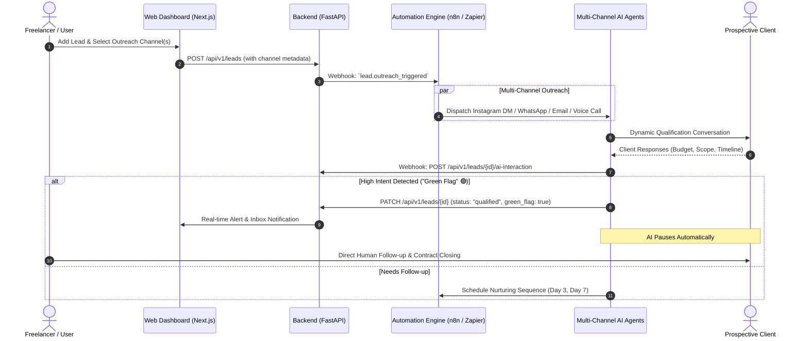

# AI Lead Outreach & Automated Qualification System — Implementation Plan

## 1. Executive Summary

This document outlines the technical architecture, data flow, integration specifications, and rollout plan for the **AI Lead Outreach & Automated Qualification Engine**.

The system enables freelancers and agencies to capture leads across multiple channels (**Instagram**, **WhatsApp**, **Email**, and **AI Phone Calls**), autonomously initiate qualification dialogues via **n8n / Zapier / Inngest**, detect high-intent buying signals (**"Green Flags" 🟢**), and notify the user for seamless human closing.

---

## 2. High-Level Architecture & Workflow



---

## 3. Supported Outreach Channels & Integrations

### A. WhatsApp Messaging
- **Integration**: WhatsApp Cloud API (Meta Developer) / Twilio WhatsApp API.
- **Workflow**: Automated template message on creation -> Interactive AI chatbot on reply -> Requirement and budget extraction -> Document gathering.

### B. Instagram DMs
- **Integration**: Meta Graph API (Instagram Direct Messages) / ManyChat / n8n Instagram Node.
- **Workflow**: Automated introductory DM to lead's handle -> Scope and service interest qualification -> Portfolio sharing -> Handover alert.

### C. Email Sequences
- **Integration**: Resend / SendGrid / Google Workspace SMTP + OpenAI / Claude LLM.
- **Workflow**: Personalized AI cold/warm outreach email -> Natural language understanding of replies -> Auto-calendaring link or proposal invite.

### D. AI Voice Calling Agent
- **Integration**: Retell AI / Vapi.ai / Bland.ai.
- **Workflow**: Outbound phone dial -> Friendly AI agent introduces agency, asks 3 key scope questions -> Audio recording and full transcript logged to lead profile.

---

## 4. "Green Flag" 🟢 Qualification & Intent Evaluation

The AI evaluates conversations against a structured scoring rubric:

| Criteria | Green Flag Signal 🟢 | Action |
| :--- | :--- | :--- |
| **Budget Match** | Client states budget >= target threshold (e.g. $1,500+) | Tag `green_flag: true`, log budget |
| **Urgency / Timeline** | Immediate need (*"Need this in 2 weeks"*, *"Ready now"*) | Boost priority to `Urgent` |
| **Decision Maker** | Client confirms authority (*"I am the founder/owner"*) | Update contact role |
| **Call-to-Action Request** | *"Can we jump on a call?"*, *"Send proposal/contract"* | **PAUSE AI** & trigger instant user notification |

---

## 5. Database Schema Additions

### PostgreSQL Migration (`005_ai_lead_automation.sql`)

```sql
-- 1. Extend Leads Table
ALTER TABLE leads
  ADD COLUMN IF NOT EXISTS outreach_channel VARCHAR(50) DEFAULT 'email',
  ADD COLUMN IF NOT EXISTS outreach_handle VARCHAR(255),
  ADD COLUMN IF NOT EXISTS ai_automation_status VARCHAR(50) DEFAULT 'idle',
  ADD COLUMN IF NOT EXISTS is_green_flag BOOLEAN DEFAULT FALSE,
  ADD COLUMN IF NOT EXISTS green_flag_reason TEXT,
  ADD COLUMN IF NOT EXISTS ai_qualification_score INTEGER DEFAULT 0,
  ADD COLUMN IF NOT EXISTS ai_paused BOOLEAN DEFAULT FALSE;

-- 2. Lead AI Interactions Log
CREATE TABLE IF NOT EXISTS lead_ai_interactions (
  id UUID PRIMARY KEY DEFAULT gen_random_uuid(),
  lead_id UUID NOT NULL REFERENCES leads(id) ON DELETE CASCADE,
  channel VARCHAR(50) NOT NULL,
  direction VARCHAR(20) NOT NULL CHECK (direction IN ('outbound', 'inbound')),
  message_content TEXT NOT NULL,
  intent_detected VARCHAR(100),
  sentiment VARCHAR(50),
  call_recording_url TEXT,
  created_at TIMESTAMPTZ NOT NULL DEFAULT NOW()
);

CREATE INDEX IF NOT EXISTS idx_lead_ai_interactions_lead_id ON lead_ai_interactions(lead_id);
```

---

## 6. API Endpoints Specification

### 1. Trigger AI Outreach
`POST /api/v1/leads/{id}/trigger-outreach`
- **Body**: `{ "channels": ["whatsapp", "instagram"], "template_override": null }`
- **Action**: Dispatches webhook to n8n/Zapier with lead data and contact handles.

### 2. Ingest AI Webhook Event (from n8n/Zapier)
`POST /api/v1/webhooks/ai-outreach`
- **Headers**: `X-Webhook-Secret: <TOKEN>`
- **Body**:
  ```json
  {
    "lead_id": "UUID",
    "channel": "whatsapp",
    "direction": "inbound",
    "message": "Yes, I have a budget of $4,000 and want to start Monday.",
    "is_green_flag": true,
    "green_flag_reason": "Confirmed $4,000 budget and immediate start date",
    "score": 95,
    "should_pause_ai": true
  }
  ```

### 3. Human Takeover (Pause AI)
`POST /api/v1/leads/{id}/pause-ai`
- **Action**: Sets `ai_paused: true`, stops automated scheduling, assigns lead to user for direct contact.

---

## 7. Frontend UI Enhancements

1. **Lead Creation / Edit Form**:
   - Channel Selector Pills: `WhatsApp`, `Instagram`, `Email`, `Phone Call`.
   - Outreach Handle / Phone input with country code validation.
   - *"Auto-Launch AI Outreach on Save"* toggle.
2. **Leads Pipeline Kanban & List**:
   - **🟢 Green Flag Badge**: Glowing green indicator on high-intent leads.
   - **AI Status Pill**: `🤖 AI Active`, `🟢 Green Flag - Ready to Close`, `⏸️ Human Takeover`.
3. **Lead Detail Page — AI Conversation Hub**:
   - Tab: `AI Outreach Log` showing message transcripts across WhatsApp, Instagram, Email, and Voice Call recordings.
   - One-click **"Take Over Conversation"** button that stops the bot and gives direct chat links.

---

## 8. Rollout Plan

- **Phase 1**: Database migrations & FastAPI webhook receiver endpoints.
- **Phase 2**: n8n / Zapier workflow templates & Meta/Twilio/Vapi API webhooks.
- **Phase 3**: Frontend UI for channel selection, Green Flag alerts, and conversation log.
- **Phase 4**: End-to-end testing with WhatsApp & Instagram test accounts.
