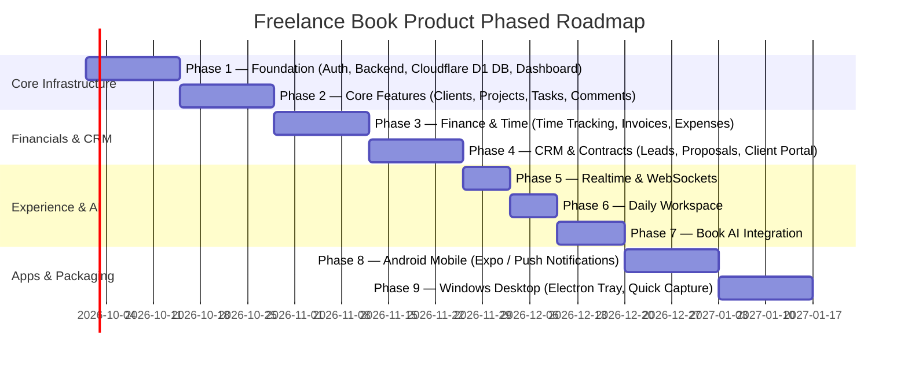

# Freelance Book — Product Requirements Document (PRD)

## 1. Executive Summary & Vision

**Freelance Book** is a comprehensive, all-in-one operating system engineered specifically for freelancers and independent professionals. It consolidates project management, client CRM, task tracking, time tracking, invoicing, expense management, contracts, file sharing, team/client communication, daily workspace planning, profit analytics, and AI assistance into a single unified platform.

The product operates on a **Free-first, production-ready architecture** spanning Web, Windows Desktop, and Android Mobile platforms.

```
Lead ──> Proposal ──> Contract ──> Project ──> Tasks ──> Time Tracking ──> Delivery/Approval ──> Invoice ──> Payment ──> Profit Analytics
```

---

## 2. Supported Platforms & Target Experience

| Platform | Core Framework | Primary Capabilities & Unique Features |
| :--- | :--- | :--- |
| **Web App** | Next.js 16 (App Router) + TypeScript | Full feature suite, dashboard, client portal, financial analytics, project views. |
| **Windows Desktop** | Electron + React (shared UI) | Global quick capture (`Ctrl+Shift+F`), system tray app, desktop notifications, persistent floating timer, optional auto-start. |
| **Android Mobile** | React Native + Expo (Expo Router) | Push notifications (FCM), mobile dashboard, on-the-go time tracking, task & client management, quick comments. |
| **Core Infrastructure** | Shared FastAPI Backend | Single account, single database, real-time sync across all client devices. |

---

## 3. Detailed Feature Requirements

### 3.1. Dashboard & Today's Focus
- **Key Metrics**: Monthly revenue, active projects, pending/overdue invoices, total billable hours tracked.
- **Today's Focus Widget**: Dynamic list of priority tasks for the current day with interactive start timer trigger.
- **Deadlines & Activity Feed**: Real-time project activity, upcoming milestones, and client notifications.

### 3.2. Client CRM & Client Management
- **Client Profiles**: Full client details, primary & secondary contacts, health score, total revenue generated.
- **Client History & Notes**: Activity timeline, internal notes, contract agreements, project list, invoice history.
- **Lead & Proposal Pipeline**: Lead status tracking (New, Contacted, Proposal Sent, Won, Lost), lead-to-client conversion workflow.

### 3.3. Project & Task Management
- **Multi-View Project Board**: Kanban (drag & drop), List, Calendar, Timeline/Gantt, Table view.
- **Milestones & Deliverables**: Milestone breakdown with progress indicators and approval statuses.
- **Tasks**: Subtasks, priority tags, estimated vs actual hours, assignee assignment, file attachments.

### 3.4. Comments, Activity & Collaboration
- **GitHub-style Timeline**: Structured comment threads on tasks, projects, and invoices.
- **Interactive Elements**: `@mentions` with auto-complete, threaded replies, file attachments, emoji reactions, resolution status.
- **Real-Time Workspace**: Live presence indicators and instant updates via WebSockets.

### 3.5. Time Tracking
- **Interactive Timers**: One-click start/stop timer across Web, Desktop Tray, and Android Mobile.
- **Categorization**: Association with specific Project and Task, billable vs non-billable flag, hourly rate overrides.
- **Financial Metrics**: Calculation of effective hourly rate (Total Revenue ÷ Total Hours Worked).

### 3.6. Financial Management & Invoicing
- **Invoicing Engine**: Professional invoice builder, line items, tax calculation, discount codes, custom terms.
- **Payments & Status**: Paid, Outstanding, Overdue, Partial Payment tracking.
- **Expense Tracking**: Expense logging by project category, receipt file attachments (Cloudflare R2).
- **Profitability Reports**: Net profit calculation per project (Invoice Revenue − Expenses − Tracked Time Cost).

### 3.7. Contracts & Proposals
- **Scope & Agreement Builder**: Revision limits, payment schedules, milestone approvals, delivery terms.
- **Document Storage**: Vault for signed client contracts (stored securely on Cloudflare R2).

### 3.8. Client Portal
- **Secure Client Access**: Dedicated view for clients to view project progress, approve milestones, download files, view/pay invoices, and communicate via messages.

### 3.9. Daily Workspace
- **Daily Operating Hub**: Daily goal setting, scratchpad daily notes, focus timer, automated daily summary (hours worked, revenue logged).

### 3.10. Book AI (AI Assistant)
- **AI Engine**: Powered by Gemini / OpenAI models integrated into the Python backend.
- **Capabilities**:
  - Auto-generate project execution plans & task lists.
  - Summarize long client communication histories.
  - Suggest daily task priorities based on upcoming deadlines.
  - Draft professional client responses and invoice descriptions.
  - Detect project delivery risks & budget overruns.
  - Query internal freelancer knowledge base.

---

## 4. Product Phased Roadmap



---

## 5. Non-Functional Requirements & Security

1. **Authentication & Identity**: Handled exclusively by **Clerk** (signups, logins, sessions, password resets, social logins).
2. **Data Security & Isolation**: Strict multi-tenant isolation enforced in the Python FastAPI backend via Workspace ID verification.
3. **Performance**: Initial page load < 1.2s; WebSocket event distribution latency < 100ms.
4. **Availability & Reliability**: Free-first cloud infrastructure leveraging free serverless SQL database (**Cloudflare D1**) and edge storage (**Cloudflare R2**).
